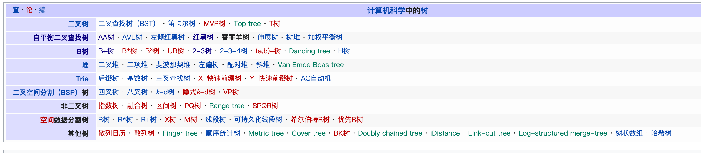

一切皆KV。  

使用一切语言实现跳表、二叉搜索树、红黑树、B树、B+树、B*树、LSM树、哈希表

set和map的关系  
set中的对象是Node，node存在主键。  
map中的对象是key=>value,实际上所有的map都可以使用set来实现。  

数据库的本质其实就是KV，关系型数据库在互联网公司也是当做KV数据库使用。一旦涉及到分布式，关系型数据库很少用到多表连接，更不用说使用外键之类的约束。非关系型数据库更是大量地使用KV结构。KV结构是最简单的数据库形式。 

平衡树和红黑树的优缺点：
* 平衡树的读取性能略优于红黑树
* 红黑树的插入、删除操作需要执行的旋转次数略少于平衡树
* 平衡树和红黑树整体性能非常接近

平衡树和红黑树之争实际上就是读写之争，对于读多写少的情形，平衡树更好；对于写多读少的情形，红黑树更好。对于读多写少的情形，如果要优化读性能，势必增加写的成本，数据必须时刻保持高度的整齐性；对于写多读少的情形，如果要优化写性能，势必增加读的成本，数据平时可以杂乱一些，因为数据摆放比较随意因此写的效率就高。

读写之争犹如人学习知识。如果囫囵吞枣死记硬背，新学的知识没有跟已有的知识发生联系，提取这块新知识的时候就会费劲；如果深刻理解了知识，在遇到一些场景时就能够快速想到这部分知识。  

在数据库领域，同样存在读写之争。MySQL和Hbase是两类场景，MySQL底层索引是B树，适用于读多写少的情形，Hbase底层索引是LSM树，适用于写多读少的情形。  

世间没有完美的结构，只有不停的权衡，根据具体问题选择具体的形式。  

数据结构所研究的问题就是内存中的数据库，Redis就是常用数据结构的集合。数据库就是算法+存储，其中算法部分又叫引擎。    

数据结构就是物理，平衡树就像结晶过程。  

跳表相对于平衡树、红黑树的优点：
* 跳表实现简洁，容易理解，可读性强，可维护性强。
* 跳表的超参数可以灵活控制高度，从而决定结构，可调节性更强。而二叉树结构深度总是固定的。  
* 跳表更容易实现并发，因为它基于链表结构，只需要锁定一块区域就可以，而树状结构锁住结点之后锁的粒度可能很大。  

B树又叫B-树，B树的特例包括二三树、平衡树。当m=3的时候，每个结点最多有3个子结点，这就是二三树。当m=2的时候，每个结点最多有2个子结点，这就是平衡树。  

B+树和B树的区别：
* B+树的value都存在于叶子结点，内部结点只有key。存储上的优点在于一个结点上能够存储更多的key，从而让树的深度尽量浅。mysql中B+树索引的深度只有三四层。
* B+树的叶子结点可以使用链表串联起来，便于进行范围扫描。

数据结构应该如何设计？先考虑存储，再考虑算法。先考虑目标，再考虑如何实现目标。首先寻找一些case，然后执行这些case。例如B树如何实现，先随机写一堆数字，然后把它们插入到B树中，写出期望B树长什么样子，而不要考虑上一步的状态，然后考虑两个状态之间如何实现转移。    

https://blog.nanpuyue.com/2019/053.html
https://blog.nanpuyue.com/2019/054.html

# 参考资料
B树：https://zh.wikipedia.org/wiki/B%E6%A0%91
AA树：https://zh.wikipedia.org/wiki/AA%E6%A0%91  Arne Andersson教授在1993年
2-3树：https://zh.wikipedia.org/wiki/2-3%E6%A0%91 2–3树由约翰·霍普克洛夫特于1970年发明 
平衡树：https://zh.wikipedia.org/wiki/%E6%9B%BF%E7%BD%AA%E7%BE%8A%E6%A0%91  
替罪羊树：https://zh.wikipedia.org/wiki/%E6%9B%BF%E7%BD%AA%E7%BE%8A%E6%A0%91