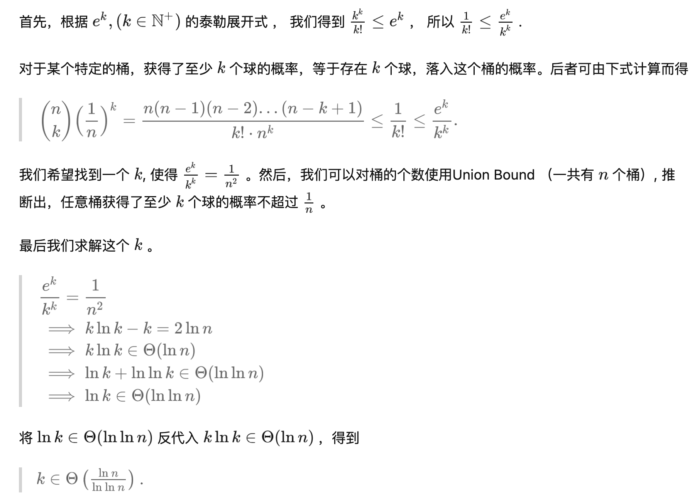
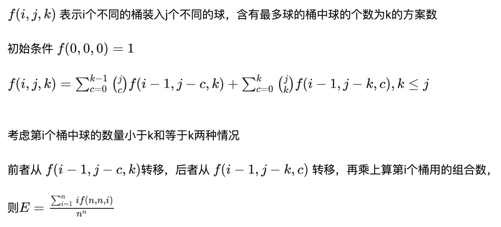

# 问题描述
表述一：m 个球每次有放回的、相互独立的取 n 次，被取最多次数的球期望被取的次数是多少。  
表述二：n个球放入m个箱子里面，球最多的箱子里面期望有多少个球？  
表述三：n个元素插入长度为m的哈希表，使用开链法解决冲突，最长的链表期望是多少？  


# 参考资料

维基百科：https://link.zhihu.com/?target=https%3A//en.wikipedia.org/wiki/Balls_into_bins_problem


某个大学的一个课件：
http://cs.williams.edu/~shikha/teaching/fall19/cs256/lectures/Lecture29.pdf

斯坦福大学某个课程证明：
https://carlstrom.com/stanford/cs161/ps3sol.pdf

知乎上的讨论：
https://www.zhihu.com/question/27893722

# 一些结论
看到有个结论是当 m=n 时，最多被取的次数期望时 O(logn/loglogn)

# 暴力模拟方法
当m=n的时候
```plain
1=>1.0 1.0==1
2=>1.5024 1.5==3/2
3=>1.8888500000000001 1.8888888888888893==17/9
4=>2.1255999999999995 2.125 17/8
5=>2.28629 2.2864000000000035
6=>2.40874 2.408179012345671
7=>2.5094100000000004 2.50906510042581
8=>2.5979 2.5972328186035156
9=>2.67671 2.676478912296715
10=>2.74581 2.7486891100011728
```

# 分数精确表示方法
使用分数精确表示
```plain
1=>1.0 1
2=>1.50102 3/2
3=>1.89001 17/9
4=>2.1257900000000003 17/8
5=>2.2842800000000003 1429/625
6=>2.40978 3121/1296
7=>2.50658 295189/117649
8=>2.59293 680849/262144
9=>2.67605 38404547/14348907
10=>2.7480700000000002 274868911/100000000
```

# n个球投入n个箱子


# 动态规划方法


